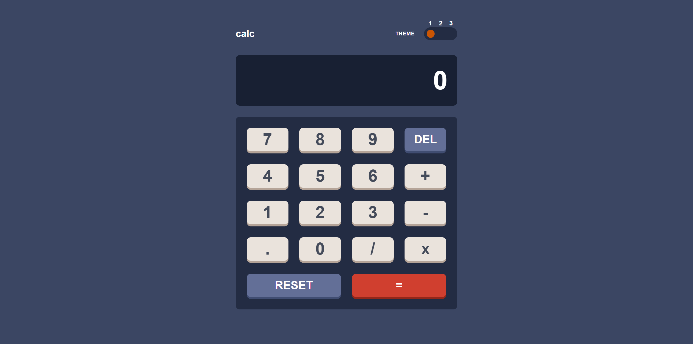
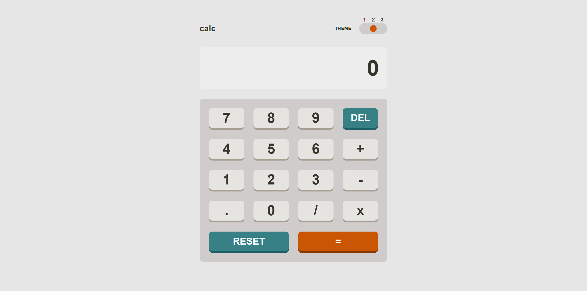
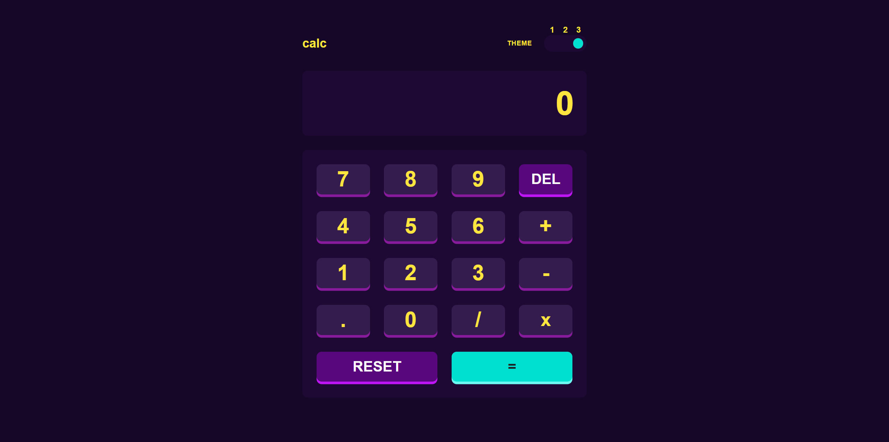
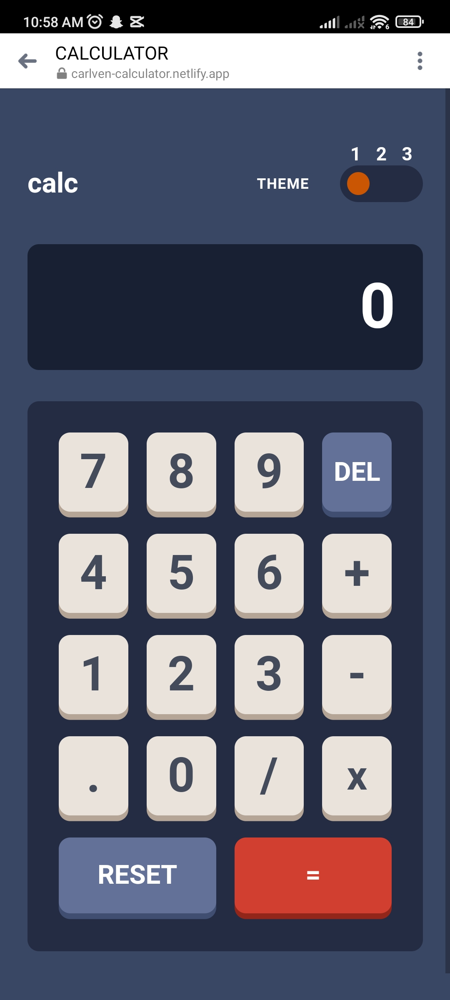
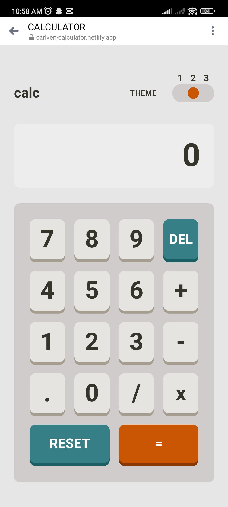
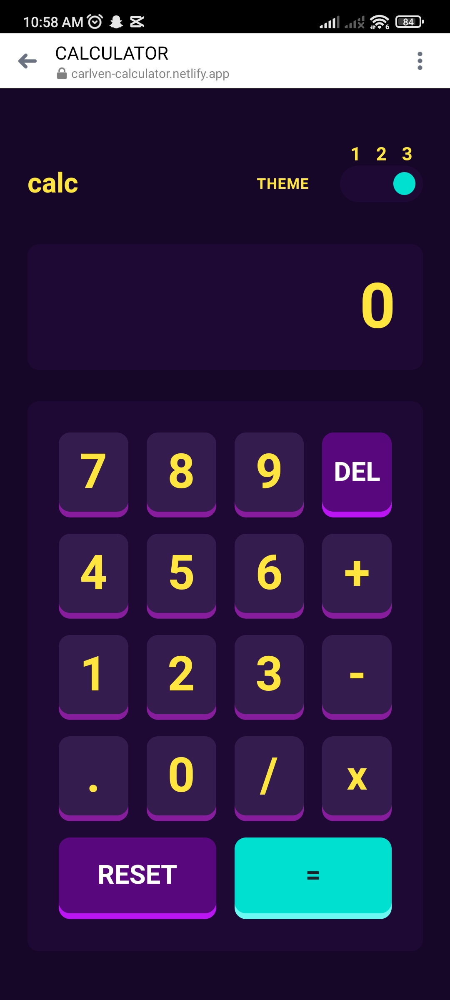

## Table of contents

- [Overview](#overview)
  - [The challenge](#the-challenge)
  - [Screenshot](#screenshot)
- [My process](#my-process)
  - [Built with](#built-with)
  - [What I learned](#what-i-learned)
  - [Continued development](#continued-development)
  - [Useful resources](#useful-resources)
- [Author](#author)

## Overview

### The challenge

Users should be able to:

- See the size of the elements adjust based on their device's screen size
- Perform mathmatical operations like addition, subtraction, multiplication, and division
- Adjust the color theme based on their preference
- **Bonus**: Have their initial theme preference checked using `prefers-color-scheme` and have any additional changes saved in the browser

### Screenshot








## My process

### Built with

- Semantic HTML5 markup
- CSS custom properties
- JS library
- React framework
- Bootstrap

### What I learned

```css
.key-red,
.key-red.k-0 {
  background: hsl(6, 63%, 50%);
  border-radius: 10px;
  color: hsl(0, 0%, 100%);
  box-shadow: 0 5px hsl(6, 70%, 34%);
}

.key-red.k-1 {
  background: hsl(25, 98%, 40%);
  box-shadow: 0 5px hsl(25, 99%, 27%);
}

.key-red.k-2 {
  background: hsl(176, 100%, 44%);
  color: hsl(198, 20%, 13%);
  box-shadow: 0 5px hsl(177, 92%, 70%);
}
```

```js
optionElements.forEach(function (element, index) {
  if (index === optionIndex) {
    element.classList.add("active");
  } else {
    element.classList.remove("active");
  }
});

// Reset background color of all options
document.querySelectorAll(".option").forEach(function (option) {
  option.style.background = ""; // Reset background color
});

// Update background color of .option.active based on optionIndex
const activeColor =
  optionIndex === 2 ? "hsl(176, 100%, 44%)" : "hsl(25, 98%, 40%)";

document.querySelectorAll(".option.active").forEach(function (activeElement) {
  activeElement.style.background = activeColor;
});

// Update hover background color based on selected option
const hoverOptionColor =
  optionIndex === 2 ? "hsl(176, 100%, 44%)" : "hsl(25, 98%, 40%)";

// Update CSS dynamically for hover effect
const styleOptionElement = document.createElement("style");
styleOptionElement.innerHTML = `
      .option:hover {
        background: ${hoverOptionColor};
        cursor: pointer;
      }
    `;
document.head.appendChild(styleOptionElement);

function calculate() {
  const tokens = expression.split(" ");
  let result = parseFloat(tokens[0]);
  for (let i = 1; i < tokens.length; i += 2) {
    const operator = tokens[i];
    const operand = parseFloat(tokens[i + 1]);
    switch (operator) {
      case "+":
        result += operand;
        break;
      case "-":
        result -= operand;
        break;
      case "x":
        result *= operand;
        break;
      case "/":
        if (operand === 0) {
          setDisplayValue("Error");
          return null;
        }
        result /= operand;
        break;
      default:
        return;
    }
  }
  // Round the result to 7 decimal places
  return parseFloat(result.toFixed(7));
}

function handleDelete() {
  const newExpression = expression.slice(0, -1);
  setExpression(newExpression);
  setDisplayValue(newExpression === "" ? "0" : newExpression);
}
```

### Continued development

Bootstrap
-I want to get familier with this to build responsive site for desktop and mobile

Javascript
-I still have a lots that need to learn how to use the unknown function to use in the program.

### Useful resources

- https://www.w3schools.com/ - You can see a example and explanation here about html/css and javascript.
- https://www.youtube.com/ - You can go through the video to learn how to do the project.
- https://www.google.com/ - You can seach anything you want to know.

## Author

- Website - [Tan Carlven](https://carlven-calculator.netlify.app)
- Frontend Mentor - [@carlven0830](https://www.frontendmentor.io/profile/carlven0830)
- Twitter - [@carlven30](https://twitter.com/carlven30)

**Note: Delete this note and add/remove/edit lines above based on what links you'd like to share.**
